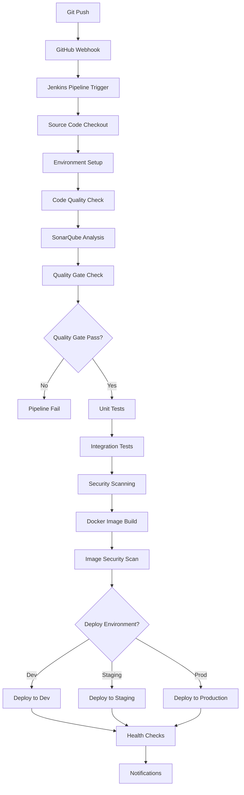

# Course Creator Platform - CI/CD Pipeline Documentation

## Overview

The Course Creator Platform uses a comprehensive CI/CD pipeline that integrates Jenkins and SonarQube for automated testing, code quality analysis, security scanning, and multi-environment deployment.

## Pipeline Architecture

### Components

1. **Jenkins** - Primary CI/CD orchestration platform
2. **SonarQube** - Code quality analysis and security scanning
3. **Docker** - Containerization and image building
4. **Kubernetes** - Container orchestration and deployment
5. **GitHub** - Source code repository and webhook triggers

### Pipeline Flow



## Jenkins Configuration

### Pipeline Structure

The Jenkins pipeline is defined in `Jenkinsfile` and includes the following stages:

#### 1. Environment Setup
- Python 3.10+ installation
- Node.js 18+ installation
- Docker and Kubernetes CLI setup
- Environment variable configuration

#### 2. Code Quality Analysis
- Linting with flake8, mypy, ESLint
- Code formatting validation
- Import organization check
- SonarQube preparation

#### 3. SonarQube Analysis
- Code quality metrics collection
- Security vulnerability scanning
- Code coverage analysis
- Technical debt assessment
- Quality gate evaluation

#### 4. Testing
- Unit tests with pytest and Jest
- Integration tests
- End-to-end tests with Playwright
- Test result publishing

#### 5. Security Scanning
- Python dependency scanning with Safety and Bandit
- JavaScript dependency scanning
- Docker image security scanning with Trivy
- Secret detection

#### 6. Build and Package
- Docker image building for all services
- Multi-architecture image support
- Image tagging and versioning
- Registry push

#### 7. Deployment
- Environment-specific configuration
- Kubernetes deployment with health checks
- Database migrations
- Service health validation
- Rollback capability

#### 8. Notifications
- Slack notifications for build status
- Email notifications for failures
- GitHub status updates

### Pipeline Parameters

| Parameter | Type | Description | Default |
|-----------|------|-------------|---------|
| `DEPLOY_ENVIRONMENT` | Choice | Target deployment environment | `none` |
| `SKIP_TESTS` | Boolean | Skip test execution (emergency) | `false` |
| `SKIP_SONAR` | Boolean | Skip SonarQube analysis | `false` |
| `FORCE_DEPLOY` | Boolean | Force deploy despite quality gate failures | `false` |
| `DOCKER_TAG_OVERRIDE` | String | Override Docker image tag | `empty` |

### Branch Strategy

- **main** - Production deployments
- **develop** - Staging deployments  
- **feature/** - Development deployments
- **hotfix/** - Emergency production fixes

## SonarQube Configuration

### Quality Profiles

#### Python Profile
- **Name**: Course Creator Python Profile
- **Rules**: 89 active rules covering:
  - Code smells and maintainability
  - Security vulnerabilities
  - Bug detection
  - FastAPI-specific patterns
  - SQLAlchemy best practices
  - Pydantic model validation

#### JavaScript Profile  
- **Name**: Course Creator JavaScript Profile
- **Rules**: 67 active rules covering:
  - Modern ES6+ patterns
  - Security (XSS, CSRF, etc.)
  - DOM manipulation safety
  - Async/await patterns
  - Module system compliance
  - Frontend security

### Quality Gate

**Name**: Course Creator Quality Gate

#### Conditions

| Metric | Threshold | Type |
|--------|-----------|------|
| New Coverage | < 75% | Error |
| Overall Coverage | < 70% | Error |
| New Vulnerabilities | > 0 | Error |
| New Security Hotspots Reviewed | < 100% | Error |
| New Bugs | > 0 | Error |
| New Code Smells | > 10 | Error |
| New Technical Debt | > 16h | Error |
| New Maintainability Rating | > A | Error |
| New Reliability Rating | > A | Error |
| New Security Rating | > A | Error |
| New Duplicated Lines | > 5% | Error |

### Custom Rules

The platform includes 20 custom rules specific to Course Creator patterns:

#### Python Rules
- FastAPI dependency injection patterns
- Pydantic model validation
- Service layer architecture
- Authentication requirements
- AI API key security
- Lab container security
- Database migration patterns

#### JavaScript Rules  
- ES6 module patterns
- API configuration management
- XSS prevention
- File upload security
- Lab terminal security
- Authentication state management
- Multi-IDE security

## Deployment Configuration

### Environments

#### Development
- **Namespace**: `course-creator-dev`
- **Replicas**: 1 per service
- **Resources**: Minimal limits
- **Features**: All enabled including debug features
- **Database**: Separate dev database
- **Monitoring**: Basic monitoring

#### Staging
- **Namespace**: `course-creator-staging`
- **Replicas**: 2 per service
- **Resources**: Production-like limits
- **Features**: Production features only
- **Database**: Staging database with prod-like data
- **Monitoring**: Full monitoring stack

#### Production
- **Namespace**: `course-creator-prod`
- **Replicas**: 3+ per service with HPA
- **Resources**: Optimized limits with autoscaling
- **Features**: Production-hardened features
- **Database**: Production database with backups
- **Monitoring**: Comprehensive observability

### Deployment Strategies

#### Blue-Green Deployment (Production)
- Zero-downtime deployments
- Full environment switch
- Instant rollback capability
- Used for production releases

#### Rolling Updates (Dev/Staging)
- Gradual service updates
- Minimal resource overhead  
- Used for development iterations

### Service Dependencies

Services must be deployed in dependency order:

1. **Infrastructure**: Database, Redis, monitoring
2. **User Management** (Port 8000)
3. **Course Generator** (Port 8001)  
4. **Course Management** (Port 8004)
5. **Content Storage** (Port 8003)
6. **Content Management** (Port 8005)
7. **Lab Containers** (Port 8006)
8. **Analytics** (Port 8007)
9. **Frontend** (Port 8080)

## Security Considerations

### Secrets Management

All sensitive data is managed through Kubernetes secrets:

- **Database credentials** - PostgreSQL connection strings
- **API keys** - Anthropic, OpenAI API keys
- **JWT secrets** - Token signing keys
- **Docker registry** - Image pull credentials
- **External services** - Slack, email service credentials

### Security Scanning

#### Static Analysis
- SonarQube security rules
- Bandit for Python security issues
- ESLint security plugins for JavaScript
- Custom security rules for Course Creator patterns

#### Dependency Scanning
- Safety for Python vulnerabilities
- npm audit for JavaScript vulnerabilities
- Trivy for container image vulnerabilities
- Automated security updates

#### Runtime Security
- Network policies for service isolation
- Pod security contexts
- Resource limits and quotas
- RBAC for service accounts

### Compliance

- **Code Coverage**: Minimum 70% overall, 75% for new code
- **Security**: Zero tolerances for vulnerabilities
- **Quality**: All code must pass quality gates
- **Documentation**: All APIs must be documented

## Monitoring and Observability

### Metrics Collection
- **Prometheus** - Metrics collection
- **Grafana** - Metrics visualization  
- **Jaeger** - Distributed tracing
- **ELK Stack** - Log aggregation

### Health Checks
- **Liveness probes** - Container health
- **Readiness probes** - Service availability
- **Startup probes** - Initialization completion

### Alerting
- **Critical alerts** - Pipeline failures, security issues
- **Warning alerts** - Performance degradation, quality issues
- **Info alerts** - Deployment notifications

## Usage Guide

### Running the Pipeline

#### Automatic Triggers
- **Git push** to any tracked branch
- **Pull request** creation or update
- **Scheduled builds** (nightly for main branch)

#### Manual Triggers
```bash
# Trigger pipeline via Jenkins CLI
java -jar jenkins-cli.jar -s http://jenkins:8080 -auth user:token \
  build course-creator-pipeline \
  -p DEPLOY_ENVIRONMENT=staging
```

#### GitHub Integration
```bash
# Configure webhook in repository settings
Webhook URL: http://jenkins:8080/github-webhook/
Content type: application/json
Events: Push, Pull request
```

### Quality Gate Override

In emergency situations, quality gates can be bypassed:

```bash
# Force deployment despite quality gate failures
java -jar jenkins-cli.jar -s http://jenkins:8080 -auth user:token \
  build course-creator-pipeline \
  -p FORCE_DEPLOY=true \
  -p DEPLOY_ENVIRONMENT=prod
```

**⚠️ Warning**: Only use force deploy for critical production fixes.

### Rollback Procedures

#### Automatic Rollback
- Failed health checks trigger automatic rollback
- Database migration failures prevent deployment
- Service startup failures rollback to previous version

#### Manual Rollback
```bash
# Rollback to previous version
kubectl rollout undo deployment/user-management -n course-creator-prod
kubectl rollout undo deployment/course-generator -n course-creator-prod
# Repeat for all services
```

### Troubleshooting

#### Common Issues

1. **Quality Gate Failures**
   - Check SonarQube analysis results
   - Review code coverage reports
   - Address security vulnerabilities

2. **Test Failures**
   - Review test reports in Jenkins
   - Check service dependencies
   - Validate test environment setup

3. **Deployment Failures**
   - Check Kubernetes events
   - Verify resource availability
   - Review service logs

4. **Health Check Failures**
   - Validate service configuration
   - Check external dependencies
   - Review resource limits

#### Debugging Commands

```bash
# Check pipeline logs
kubectl logs -f deployment/jenkins -n jenkins

# Check service status
kubectl get pods -n course-creator-prod

# Check service logs
kubectl logs -f deployment/user-management -n course-creator-prod

# Check pipeline history
java -jar jenkins-cli.jar -s http://jenkins:8080 -auth user:token \
  list-builds course-creator-pipeline
```

## Setup Instructions

### Initial Setup

1. **Install Jenkins**
   ```bash
   ./jenkins/jenkins-setup.sh
   ```

2. **Configure SonarQube**
   ```bash
   ./sonarqube/setup-sonarqube.sh
   ```

3. **Setup Kubernetes Environment**
   ```bash
   # Apply base configuration
   kubectl apply -k deploy/k8s/base/
   
   # Apply environment-specific overlays
   kubectl apply -k deploy/k8s/overlays/prod/
   ```

4. **Configure Credentials**
   - Update Jenkins credentials with actual values
   - Configure GitHub webhook
   - Set up SonarQube authentication token
   - Configure Slack notifications

### Maintenance

#### Regular Tasks
- **Weekly**: Review quality metrics and trends
- **Monthly**: Update dependency versions
- **Quarterly**: Review and update security policies

#### Updates
- **Jenkins plugins**: Update monthly during maintenance windows
- **SonarQube**: Update quarterly with testing period
- **Base images**: Update weekly with security patches

## Best Practices

### Development Workflow

1. **Feature Development**
   - Create feature branch from develop
   - Follow TDD approach with tests first  
   - Ensure code passes local quality checks
   - Submit pull request with comprehensive description

2. **Code Review**
   - All code must be reviewed by at least one team member
   - SonarQube analysis must pass
   - All tests must pass
   - Security review for sensitive changes

3. **Integration**
   - Merge to develop triggers staging deployment
   - Validate functionality in staging environment
   - Performance testing in staging
   - Merge to main for production deployment

### Quality Standards

- **Test Coverage**: Maintain >80% code coverage
- **Code Quality**: Zero tolerance for security vulnerabilities
- **Documentation**: All public APIs must be documented
- **Performance**: Response times <200ms for API endpoints
- **Security**: Regular security scans and updates

### Security Guidelines

- **Secrets**: Never commit secrets to repository
- **Dependencies**: Keep dependencies updated
- **Access Control**: Follow principle of least privilege
- **Monitoring**: Monitor for security events
- **Incident Response**: Have procedures for security incidents

## Reference

### Useful Links

- [Jenkins Documentation](http://jenkins:8080/jenkins/documentation)
- [SonarQube Project](http://sonar:9000/dashboard?id=course-creator)
- [Kubernetes Dashboard](http://kubernetes-dashboard/)
- [Grafana Monitoring](http://grafana:3000)

### Configuration Files

- `Jenkinsfile` - Pipeline definition
- `sonar-project.properties` - SonarQube configuration
- `deploy/k8s/` - Kubernetes manifests
- `scripts/deploy.sh` - Deployment automation

### Support

For issues with the CI/CD pipeline:

1. Check this documentation
2. Review Jenkins and SonarQube logs
3. Contact the platform team
4. Create issue in project repository